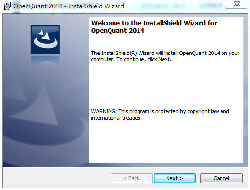
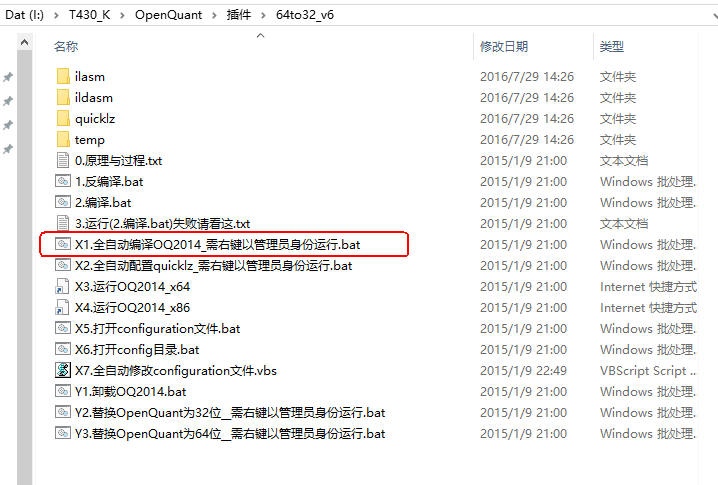
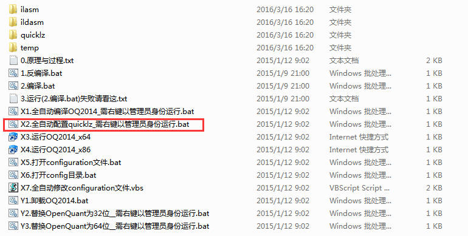
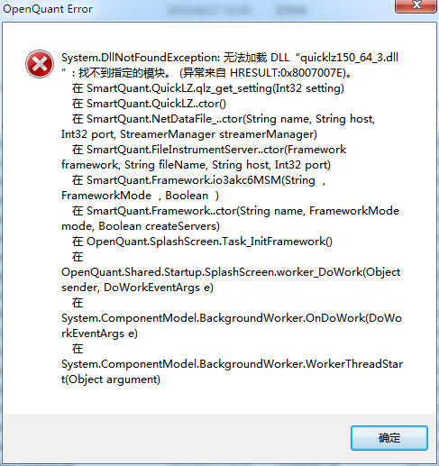
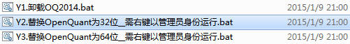
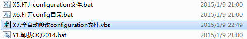
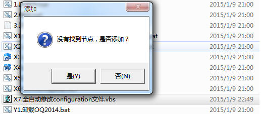

#### OpenQuant平台安装

##### 一、安装前准备

* 64位Windows7及以上系统
* 下载OpenQuant2014安装包
* 下载64位转32位工具
* 下载QuantBox统一接口完整版_v0.9.5.1.zip

下载的方法有2个：
* DIY宽客网上[下载](http://www.diyq.cn/thread-4-1-1.html)
* XAPI技术交流群的群文件共享中下载，QQ群号：377319643

##### 二、安装步骤

######1、安装.Net Framework4.5.1
由于OpenQuant用到了新版的.Net Framework，所以需要首先安装.Net Framework，建议的安装方式如下：
* 到微软的网站[下载安装包](https://support.microsoft.com/zh-cn/kb/2858728)

  如下图：

  

【注】如果同时需要安装VS2015做开发的话，就不需要单独安装.Net Framework，在安装VS2015的过程中会自动安装.Net Framework。

###### 2、安装OpenQuant2014程序

双击下载的OpenQuant2014安装程序，按照弹出的提示进行安装。如图：

【注】安装路径目前只能在C盘，不能进行更改。但是安装完成以后可以将C盘的安装目录复制到其他盘符。

###### 3、64位向32位转换

由于现在国内还有市场只提供32位的行情和交易API，所以XAPI在发布的时候，缺省是编译成32位的。如果OpenQuant安装的目的仅仅是用来做历史回测的话，那么不必须转换成64位，实际上，如果回测的数据量比较大的话，还必须使用64位的OpenQuant。

① 打开64to32\_v6文件夹，选中`X1.全自动编译OQ2014_需右键以管理员身份运行.bat`，右键以管理员身份运行.bat。如下图：

② 打开64to32\_v6文件夹，选中`X2.全自动配置quicklz_需右键以管理员身份运行.bat`，右键以管理员身份运行。如下图：

【注】如果没有执行这个步骤，直接打开C盘，找到`Program Files\SmartQuant Ltd\OpenQuant2014\`，双击`OpenQuant.x86.exe`，如图所示：

可能会弹出如下错误：

此时，需要将弹出的错误页面关掉，同时将程序关掉，重新执行本步骤。

③ 打开64to32\_v6文件夹，选中`Y2.替换OpenQuant为32位_需右键以管理员身份运行.bat`，右键以管理员身份运行。如下图：

完成此步骤，即完成了64位到32位的转换。
【注】如果没有执行这个步骤，直接运行`OpenQuant.x86.exe`，可能会弹出如下错误：

④ 打开64to32\_v6文件夹，选中`X7.全自动修改configuration文件.vbs`，双击，会出现“没有找到节点，是否添加？”，选择是。如下图：

这个是为下面安装XAPI插件做准备。

###### 4、安装XAPI插件

① 打开`QuantBox统一接口完整版_v0.9.5.1\X3`目录，选中`X1.复制bin和System32目录_需右键以管理员身份运行.bat`，右键以管理员身份运行。

② config文件复制

* 打开`QuantBox统一接口完整版_v0.9.5.1\X3\config`，复制所有文件
* 找到`QuantBox统一接口完整版_v0.9.5.1\X3`下的`X6.打开config目录.bat`，双击如下图：

* 将从 config中复制所有文件粘贴进去

③ 运行OpenQuant2014，点击View菜单下面的Execution, 可以看到插件。如下图：

至此，整个程序安装完毕。
