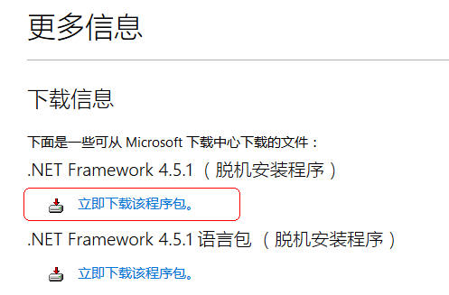

#### OpenQuant平台安装

##### 一、安装前准备

* 64位Windows7及以上系统
* 下载OpenQuant2014安装包
* 下载64位转32位工具
* 下载QuantBox统一接口完整版_v0.9.5.1.zip

下载的方法有2个：
* DIY宽客网上[下载](http://www.diyq.cn/thread-4-1-1.html)
* XAPI技术交流群的群文件共享中下载，QQ群号：377319643

##### 二、安装步骤

######1、安装.Net Framework 4.5.1
由于OpenQuant用到了新版的.Net Framework，所以需要首先安装.Net Framework，建议的安装方式如下：
* 到微软的网站[下载安装包](https://support.microsoft.com/zh-cn/kb/2858728)

  如下图：
  
