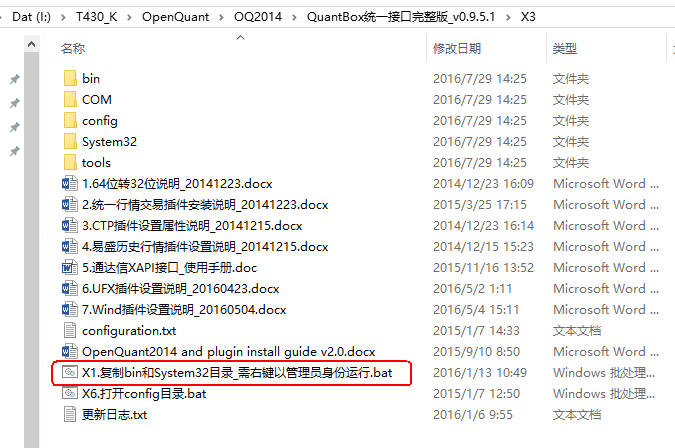
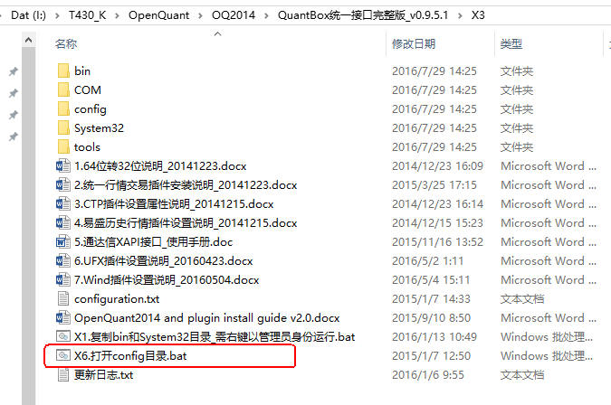
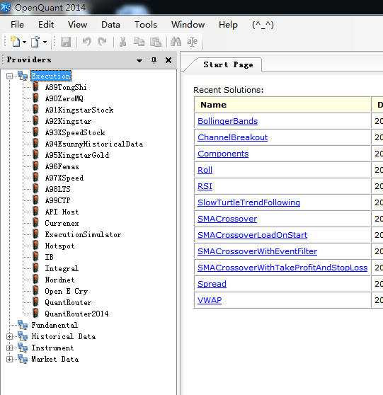

#### 5.2.2 安装XAPI插件

##### 一、安装前准备

* 已经安装OpenQuant平台
* 已经将OpenQuant转换到32位
* 下载QuantBox统一接口完整版_v0.9.5.1.zip

下载的方法有2个：
* DIY宽客网上[下载](http://www.diyq.cn/thread-4-1-1.html)
* XAPI技术交流群的群文件共享中下载，QQ群号：377319643

##### 二、安装步骤

###### 1、初始安装

① 打开`QuantBox统一接口完整版_v0.9.5.1\X3`目录，选中`X1.复制bin和System32目录_需右键以管理员身份运行.bat`，右键以管理员身份运行。

② config文件复制

* 打开`QuantBox统一接口完整版_v0.9.5.1\X3\config`，复制所有文件
* 找到`QuantBox统一接口完整版_v0.9.5.1\X3`下的`X6.打开config目录.bat`，双击如下图：

* 将从 config中复制所有文件粘贴进去

③ 运行OpenQuant2014，点击View菜单下面的Execution, 可以看到插件。如下图：

至此，整个程序安装完毕。
