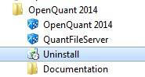

#### 5.2.3 卸载OpenQuant

由于OpenQuant2014目前处于活跃的开发周期，更新相当频繁，最好在安装新版前完全卸载干净。OpenQuant的安装程序并不会覆盖用户文件，如数据、配置、策略文件因此，如果你不手动删除它们，可能会错过这些文件中的重要更新。

完全卸载需要做以下4个步骤：

* 执行开始菜单中卸载工具Uninstall

* 手工删除`C:\Users\xxxxx\AppData\Roaming\SmartQuant Ltd\OpenQuant 2014\`文件夹
* 手工删除`C:\Users\xxxxx\Documents\OpenQuant 2014\Solutions\`文件夹
* 手工删除`C:\Program Files\SmartQuant Ltd\`文件夹，这个步骤同时会将插件删除干净。

【注】如果上面的文件夹中有你自己编写的策略，请先备份到其他目录中；目录路径中的`xxxxx`请替换成你自己的用户名。
