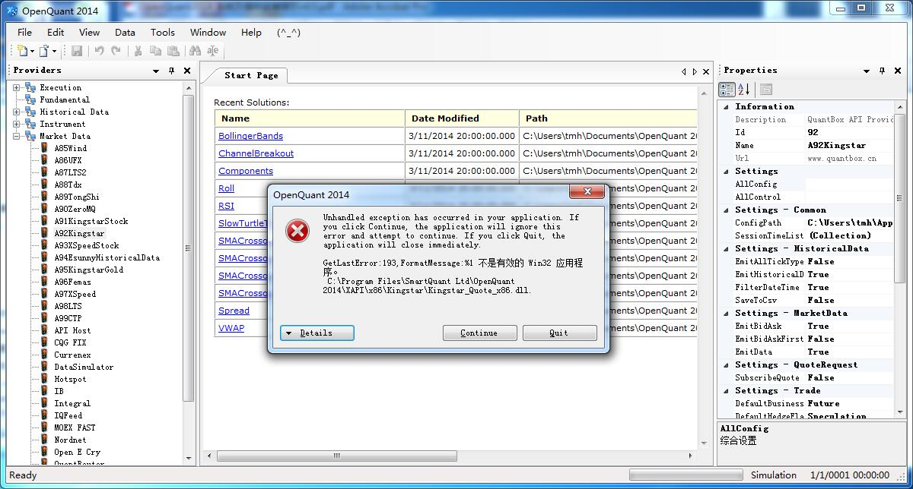
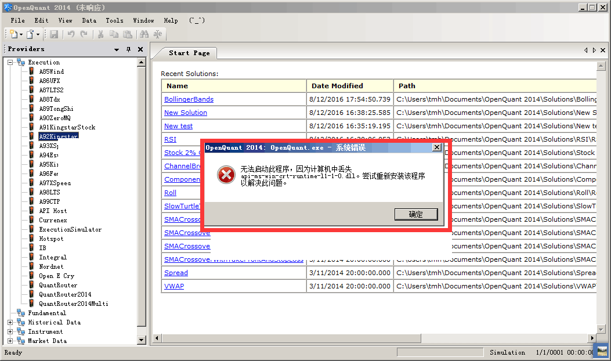
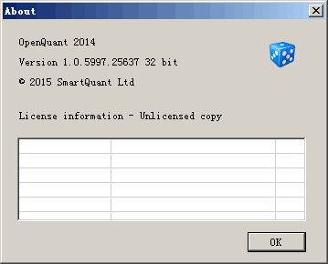

#### 5.2.4 FAQ

##### 一、运行XAPI插件出现不是有效的Win32程序

这个是发生错误的截图：

或者是这样的：

- 此时，首先检查OpenQuant的About菜单，查看当前运行的OpenQuant是64位的还是32位的，由于XAPI缺省是编译成32位的，所以必须将OpenQuant转换成32位的再运行。

- 如果上述步骤做了，还是没解决问题，那么尝试安装Visual C++ Redistributable for Visual Studio 2015
